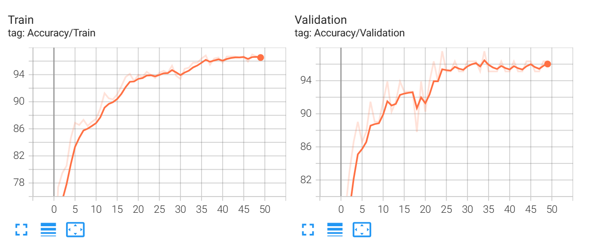
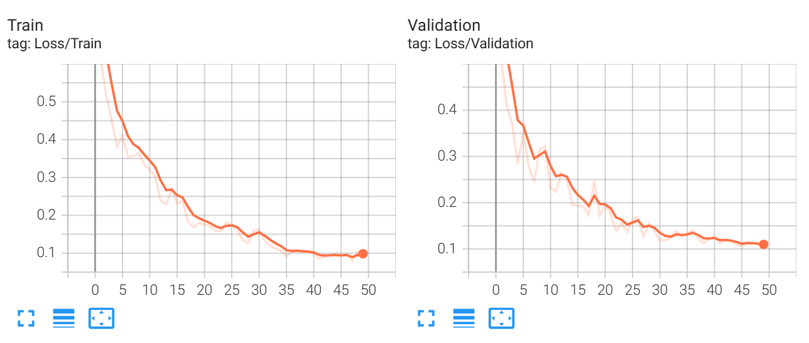
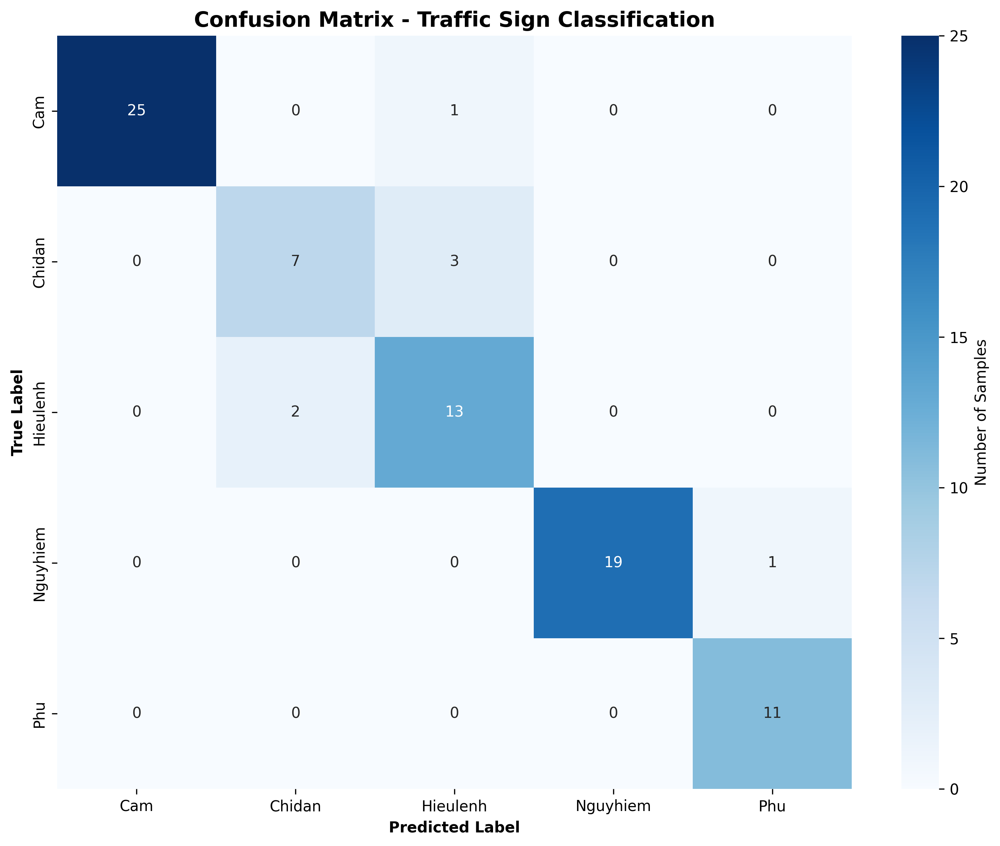
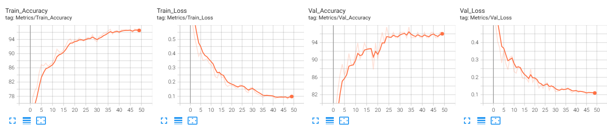
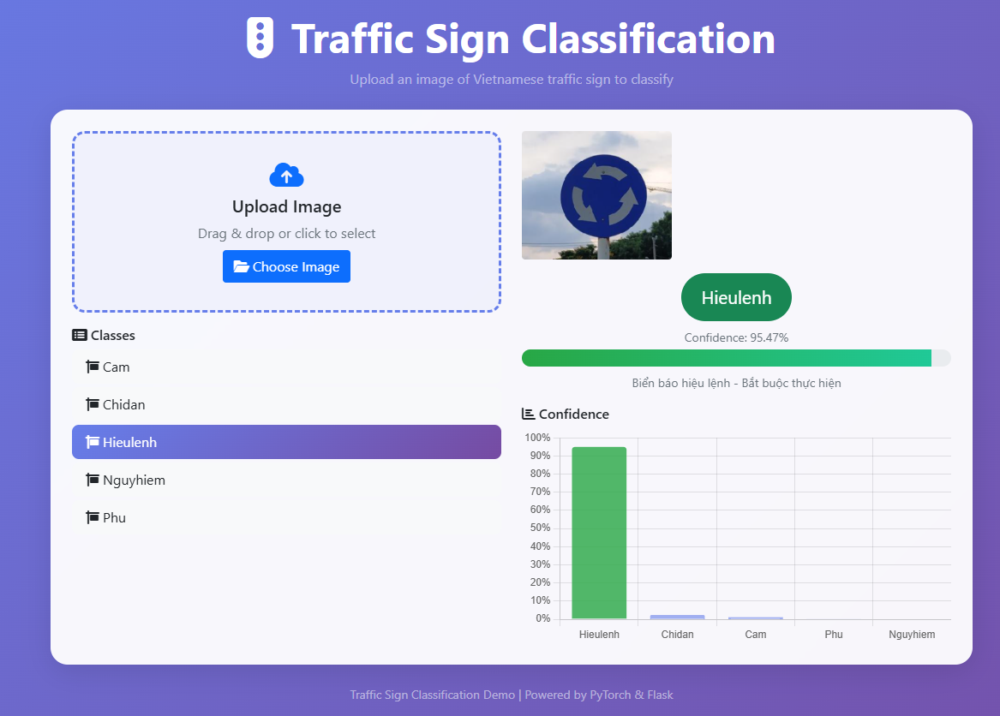
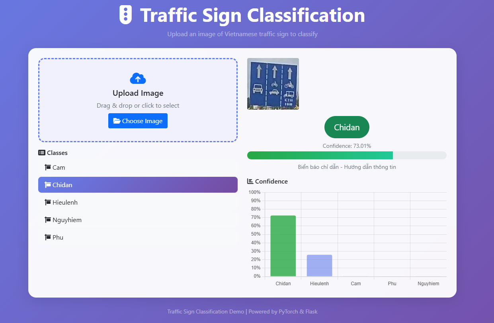
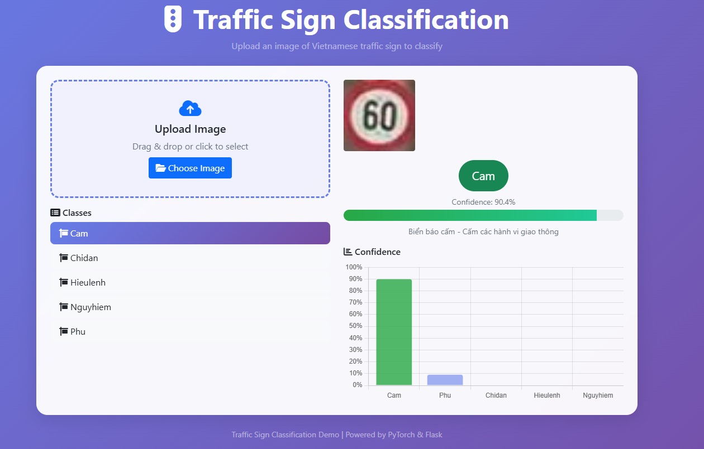

<h1 align="center">
  <br>
  🚦 Traffic Sign Recognition System
  <br>
</h1>

<h4 align="center">A deep learning-based traffic sign detection and classification system for Vietnamese roads</h4>

<p align="center">
  <a href="#">
    
  </a>
  <a href="#">
    
  </a>
  <a href="#">
    
  </a>
  <a href="#">
    
  </a>
</p>

<p align="center">
  <a href="#overview">Overview</a> •
  <a href="#features">Features</a> •
  <a href="#results">Results</a> •
  <a href="#demo">Demo</a> •
  <a href="#installation">Installation</a> •
  <a href="#usage">Usage</a> •
  <a href="#team">Team</a>
</p>

## Overview

This project implements a **real-time traffic sign recognition system** using deep learning with PyTorch. The system classifies Vietnamese traffic signs into 5 categories with high accuracy and provides a user-friendly web interface for predictions.

**Traffic Sign Categories:**
- **Cam** - Prohibition signs
- **Chidan** - Direction signs  
- **Hieulenh** - Command signs
- **Nguyhiem** - Danger warning signs
- **Phu** - Supplementary signs

## Features

### Core Capabilities
- **High Accuracy**: 95%+ accuracy on test set
- **Real-time Prediction**: Fast inference with optimized model
- **Web Interface**: Beautiful Flask web application
- **Comprehensive Evaluation**: Detailed metrics and visualization

### Technical Features
- **Custom CNN Architecture**: Optimized for traffic sign recognition
- **Data Augmentation**: Advanced preprocessing pipeline
- **TensorBoard Integration**: Real-time training monitoring
- **Model Checkpoints**: Automatic saving of best models
- **Production Ready**: Well-structured, documented code

## 📊 Training Results

### Accuracy and Loss Curves
<p align="center">
  
  
</p>

### Confusion Matrix
<p align="center">
  
</p>

### Performance Metrics
<p align="center">
  
</p>

### Demo Interface
<p align="center" style="display: flex; justify-content: center; gap: 20px;">
  
  
  
</p>


<h2>📈 Performance Summary</h2>

<table>
  <thead>
    <tr>
      <th>Metric</th>
      <th>Value</th>
      <th>Description</th>
    </tr>
  </thead>
  <tbody>
    <tr><td><b>Overall Accuracy</b></td><td><b>95.12%</b></td><td>Tỷ lệ dự đoán chính xác tổng thể</td></tr>
    <tr><td><b>Precision (Weighted Avg)</b></td><td><b>95.12%</b></td><td>Độ tin cậy trung bình của dự đoán positive</td></tr>
    <tr><td><b>Recall (Weighted Avg)</b></td><td><b>95.12%</b></td><td>Khả năng phát hiện chính xác các đối tượng</td></tr>
    <tr><td><b>Macro F1-Score</b></td><td><b>93.3%</b></td><td>Trung bình cân bằng giữa Precision và Recall</td></tr>
    <tr><td><b>Inference Time</b></td><td>~15ms</td><td>Thời gian xử lý mỗi ảnh</td></tr>
  </tbody>
</table>

<hr>

<h3>Misclassification Analysis</h3>

<table>
  <thead>
    <tr>
      <th>#</th>
      <th>True Label</th>
      <th>Predicted Label</th>
      <th>Confidence</th>
    </tr>
  </thead>
  <tbody>
    <tr><td>1</td><td>Chidan</td><td>Hieulenh</td><td>0.804</td></tr>
    <tr><td>2</td><td>Hieulenh</td><td>Chidan</td><td>0.721</td></tr>
    <tr><td>3</td><td>Chidan</td><td>Hieulenh</td><td>0.578</td></tr>
    <tr><td>4</td><td>Hieulenh</td><td>Chidan</td><td>0.542</td></tr>
  </tbody>
</table>

<p><b>Số mẫu sai:</b> 4 / 82<br>
<b>Tổng số mẫu kiểm thử:</b> 82</p>

<hr>

<h2>🛠 Installation</h2>

<h3>Prerequisites</h3>
<ul>
  <li>Python 3.8+</li>
  <li>PyTorch 1.9+</li>
  <li>Flask 2.0+</li>
</ul>

<h3>Run Evaluation Example</h3>

<pre><code>python evaluate.py
</code></pre>

<p><b>Kết quả ví dụ:</b></p>

<pre><code>Using device: cuda
Loaded model from 'model_state'
Test samples: 82
Overall Test Accuracy: 95.12%
</code></pre>


## 🛠 Installation

### Prerequisites
- Python 3.8+
- PyTorch 1.9+
- Flask 2.0+

### Quick Start
```bash
# Clone repository
git clone https://github.com/your-username/traffic-sign-recognition.git
cd traffic-sign-recognition

# Install dependencies
pip install -r requirements.txt

# Run data preprocessing
python data_preprocessor.py

# Start training
python train.py
💻 Usage
Training the Model
bash
# Basic training
python train.py

# Resume training from checkpoint
python train.py --resume

# Monitor with TensorBoard
tensorboard --logdir runs --port 6006
Evaluation
bash
# Evaluate model performance
python evaluate.py
Web Application
bash
# Start Flask web server
python web_demo.py

# Access at: http://localhost:5000
📁 Project Structure
text
traffic_sign_project/
├── 📊 data/                    # Dataset annotations
│   ├── train.csv
│   ├── valid.csv
│   └── test.csv
├── 🖼️ dataset/                 # Image datasets
│   ├── train/
│   ├── valid/
│   └── test/
├── 🤖 models/                  # Trained models
│   ├── best_model.pth
│   └── last_model.pth
├── 📈 runs/                    # TensorBoard logs
├── 📸 image_results/           # Result visualizations
├── 🔧 src/                     # Source code
│   ├── data_loader.py
│   ├── data_preprocessor.py
│   ├── model.py
│   ├── train.py
│   ├── evaluate.py
│   └── web_demo.py
└── 📄 requirements.txt
